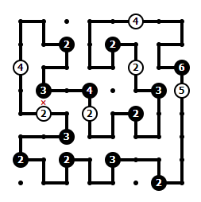

# RCRA-Shingoki
Práctica para la asignatura de RCRA. Ingeniería informática UDC. 
Realizada por:
- Guillermo Fernández Sánchez
- [Rodrigo Naranjo González](https://github.com/rng1)

Nota: 2/2

Enlace con el enunciado: https://www.dc.fi.udc.es/~cabalar/kr/current/ex1.html


## Introduction



In this exercise we will play with clingo to find solutions to the Shingoki puzzle. [Shingoki](https://www.puzzle-shingoki.com/) is a puzzle that consists in drawing segments among points in a grid of N x N so that all segments form a **single, cyclic path**. Some grid points contain numbers in a circle that can be additionally black or white. The puzzle constraints are the following:

1. All edges must form a single, linear loop. No crossing or branching is allowed.
2. The loop must pass through all numbered circles.
3. White circles must be passed through in a straight line.
4. Black circles must always be in the corner of a turn.
5. The number in each circle must be the sum of the lengths of the 2 straight lines segments going out of that circle.

To understand the game rules, you can try to play online at https://www.puzzle-shingoki.com/

##  Steps

1. Encode the Shingoki problem as an ASP program that solves the puzzle for any instance. This program is our Knowledge Base and will be called **shingokiKB.lp**

   

2. Each puzzle instance will be provided as an ASCII file shingokiX.txt with the following format. Each line contains **n** integer numbers separated by (one or more) blank spaces. A zero represents a regular grid point without any restriction, a strictly positive number represents a white circle and a strictly negative number represents a black circle. As an example, the input file for the scenario in the picture above could look like:

```
 0  0  0  0  0  4  0  0
 0  0 -2  0 -2  0  0  0
 4  0  0  0  0  2  0 -6
 0 -3  0 -4  0  0 -3  5
 0  2  0  2  0 -2  0  0
 0  0 -3  0  0  0  0  0
-2  0 -2  0 -3  0  0  0
 0  0  0  0  0  0 -2  0
```

You will build a python program called **encode.py** that takes the shingokiX.txt file as an input and creates an **shingokiX.lp** file describing the instance as a set of ASP facts. The file shingoki.lp **will exclusively consist of facts** (it cannot contain rules or constraints). An example of use could be:

​    python3 encode.py < shingoki1.txt > shingoki1.lp

------

3. Finally, we will translate back the answer set into a complete Shingoki solution, printing the final result in standard output. The solution will have the following format: show a '+' in each empty grid point, and lines displaying the connections.

```
+--+  +  +--+--+--+--+
|  |     |           |
+  +--+  +  +--+  +--+
|     |  |  |  |  |
+  +--+  +--+  +  +--+
|  |           |     |
+  +--+--+  +  +--+  +
|        |        |  |
+--+--+  +  +--+  +  +
      |  |  |  |  |  |
+--+--+  +--+  +--+  +
|                    |
+--+  +--+  +--+--+  +
   |  |  |  |     |  |
+  +--+  +--+  +  +--+
```

Again, we will build a python program called **decode.py** that will take the output of clingo and generate the solution file. A possible execution could be:

​    clingo shingokiKB.lp shingoki1.lp | python decode.py > solution1.txt

4. You can use or adapt the following visualizer in clingraph, [viz.lp](./viz.lp), to be executed with the following [command](./command). The input for the visualizer is based on predicates:

- size(N) = the number N of rows and columns in the square grid
- number( (X,Y), N) = it means there is a non-zero number N in the position (X,Y) in the input file
- seg((X,Y), (X',Y')) = it means that your solution has a segment from (X,Y) to (X',Y')


